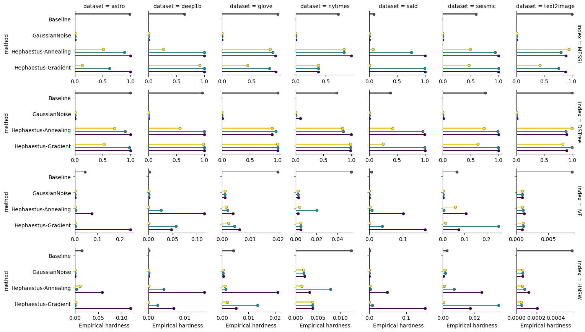
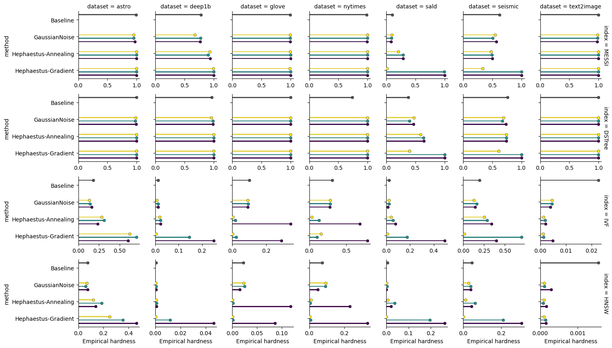

# Workloads Generation: Experimental Pipeline
This repository provides the experimental setup and evaluation scripts for the paper on generating query workloads with controllable hardness for high-dimensional vector similarity search.
It supports running comprehensive experiments to evaluate various query generation algorithms — Hephaestus-Annealing and Hephaestus-Gradient — designed to produce workloads with specific levels of empirical and explicative hardness. These workloads facilitate the empirical evaluation of index data structures under varying degrees of query difficulty.

**Related paper**: [Evaluating and Generating Query Workloads for High Dimensional Vector Similarity Search](link)

To ensure generality, we evaluate performance across four different index types:

- **Exact indexes:** `MESSI` [1], `DSTree` [2]  
- **Approximate indexes:** `HNSW`, `IVF` (implemented via the `FAISS` library [3])


## Implementation

All algorithms are implemented in Python 3.12. We use **JAX** for automatic differentiation in the **Hephaestus-Gradient** algorithm, and the **Adam** optimizer (as implemented in **Optax**) to perform optimization steps. The learning rate is a configurable parameter to allow fine-tuning.

We also provide an easy-to-use standalone Python implementation of our methods, which can be found in this repository.[^4]

[^4]: See the [hephaestus](https://github.com/cecca/hephaestus) repository for the standalone implementation.


## Repository Structure

The `workflow` folder contains automation tools and scripts designed to streamline the experimental pipeline, including:

- **Snakemake workflow definitions** for managing complex experiment dependencies and execution order
- A **config.yaml** file and **parameters.py** script that together specify global settings, key experimental parameters, and utilities used by the workflows.

The code relies on the following environment variables to locate important directories:
```
WORKGEN_DATA_DIR = # where datasets are stored
WORKGEN_DATA_DIR/generated = # where generated workloads should go
WORKGEN_RES_DIR = # where results should reside

```

In `WORKGEN_RES_DIR` we have

```
$WORKGEN_RES_DIR/dataset~NAME/workload_key~SHA/BINPATTERN.bin
```

Where `BINPATTERN` is

```
datasetname-distance-dimensions-n
```


## Installation

Clone the repository and install the required dependencies:

```bash
git clone https://github.com/Cecca/workloads-generation.git
cd workloads-generation
conda env create -f environment.yml
conda activate workloads-generation
```

Alternatively, if you have mamba installed:

```bash
mamba env create -f environment.yml
```

This installs all required dependencies, including:

- `jax`, `optax` — for gradient-based workload generation  
- `faiss-cpu` — for approximate nearest neighbor search  
- `snakemake` — for managing experimental workflows  
- `numpy`, `pandas`, `seaborn`, `tqdm`, and others


## Usage Example

### Step 1: Set environment variables

```bash
export WORKGEN_DATA_DIR=/path/to/datasets
export WORKGEN_RES_DIR=/path/to/results
export MESSI_INSTALL_DIR=/path/to/messi/
export DSTREE_INSTALL_DIR=/path/to/dstree/
```

### Step 2: Run the experimental pipeline

```bash
snakemake --cores 4
```

This command executes the full workflow defined in workflow/Snakefile, including:

- Generating query workloads
- Running evaluations on multiple index structures
- Collecting and storing the results


## Additional Experimental Results

This section provides extended results that complement the analysis in Section 5.2 of the paper, which were omitted for brevity. The experiments follow the same setup, evaluating the **empirical hardness** of workloads generated by three methods: **Hephaestus-Annealing**, **Hephaestus-Gradient**, **GaussianGen**. 

Each workload is generated to target a specific **Relative Contrast (RC)** range, corresponding to three difficulty levels: easy, medium, hard.

The workloads are evaluated across multiple index data structures (both exact and approximate) to ensure generality of the results.

Specifically, we report results on average empirical hardness across different index data structures and datasets for workloads of varying difficulty levels — *easy*, *medium*, and *hard* — for `k = 1` (*Figure 1*) and `k = 10` (*Figure 2*).



**Figure 1.** Empirical hardness by index and dataset for *easy*, *medium*, and *hard* workloads ( k = 1 ).




**Figure 2.** Empirical hardness by index and dataset for *easy*, *medium*, and *hard* workloads ( k = 10 ).


## References

[1]: Botao Peng, Panagiota Fatourou, and Themis Palpanas. 2020. [MESSI: In-Memory
Data Series Indexing.]( https://arxiv.org/abs/2009.00786 ) In ICDE. IEEE, 337–348.

[2]: Yang Wang, Peng Wang, Jian Pei, Wei Wang, and Sheng Huang. 2013. [A Data-
adaptive and Dynamic Segmentation Index for Whole Matching on Time Series.](https://www.vldb.org/pvldb/vol6/p793-wang.pdf)
Proc. VLDB Endow. 6, 10 (2013), 793–804.  

[3]: Matthijs Douze, Alexandr Guzhva, Chengqi Deng, Jeff Johnson, Gergely Szilvasy,
Pierre-Emmanuel Mazaré, Maria Lomeli, Lucas Hosseini, and Hervé Jégou. 2024.
[The Faiss library.](https://arxiv.org/abs/2401.08281) CoRR abs/2401.08281 (2024).
Source code: [https://github.com/facebookresearch/faiss](https://github.com/facebookresearch/faiss)

